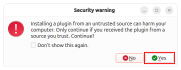
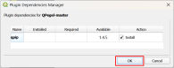
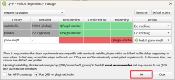
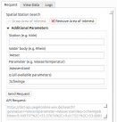
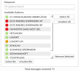
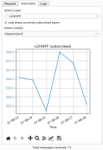
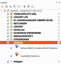

# QPegel 

 

A QGIS plugin for interactive hydrological sensor station discovery via DICT-API and real-time, push-based data visualization using the MQTT protocol.

The plugin was developed based on the [PegelOnline](https://www.pegelonline.wsv.de/gast/start) and [EDIS](https://www.itzbund.de/DE/itloesungen/egovernment/echtzeitdateninfrastruktur/edis.html) project.

## Installation
### Installation via zip
1. Download QPegel from Github
2. In QGIS open from menu: Plugins -> Manage and Install Plugins... -> Install from ZIP
3. Choose QPegel-master.zip
4. Click "Install Plugin"
5. Choose **Yes**

6. For the next two screens, check the settings and choose **OK**

7. Check for the QPegel logo in your toolbars
    - if necessary, add the "Plugins Toolbar" to your QGIS interface

## Core Features
### Station Search & Handling
- Integrated DICT-API for easy map- and parameter-based station search

- Station handling: subscribe, unsubscribe or remove selected stations

### Visualization
- Plots: view data (updating automatically with new incoming data)

- Map: view stations and latest measurement in the map canvas

## Usage
> This plugin is only usable with valid user data. If you are interested to test it, contact us at 52°North
> 
> To connect and receive data a stable internet connection is required.
> 
> If interested, find more detailed information in the [Documentation](https://github.com/Juliarotert/QPegel/blob/master/docs/documentation.md) 

### Example Workflow
1. Login
    - fill in the user data and **connect**
2. Set request parmeters (Tab "Request")
    - define AOI
        - click **Draw Area of Interest**
        - draw a polygon inside the map 
        - finish by right-clicking
    - add parameters
        - open **Additional Parameters** 
        - add a river (located in your AOI)
3. **Send Request**
    - info: you can send multiple requests with different parameters, the new stations will be appended to the previously retrieved ones
    - if there is no parameter input, you will receive all existing stations
5. Select Available Stations of Interest
6. **Subscribe**
    - the selected stations are added to the layer panel and will store incoming data (have a look in the attribute table later)
    - as soon as the first data arrives you can also see a label showing a small station statistic
7. Switch to the Tab "View Data"
    - choose a station
    - choose visible units (if >1 available)
8. **Wait and see new data arrive...**

