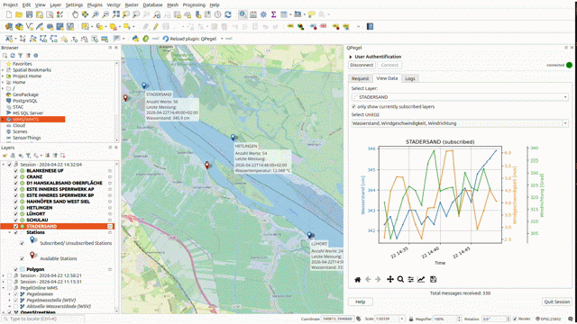
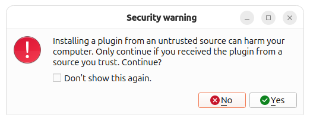
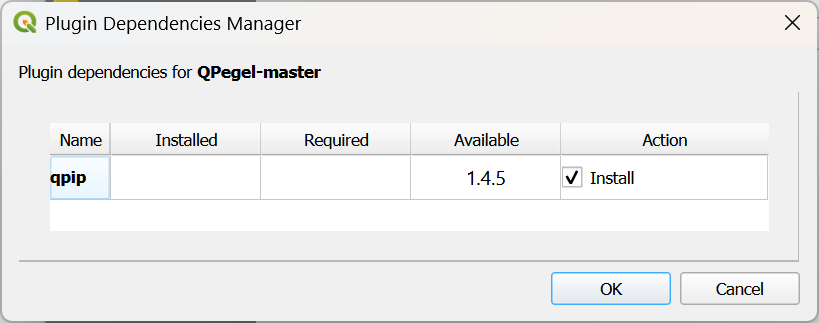
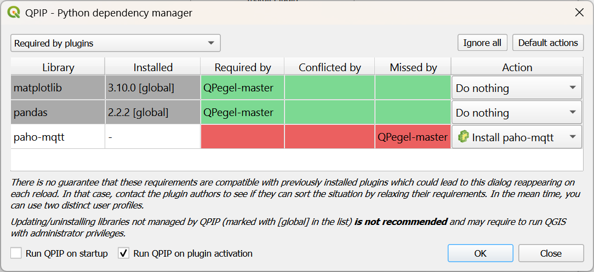
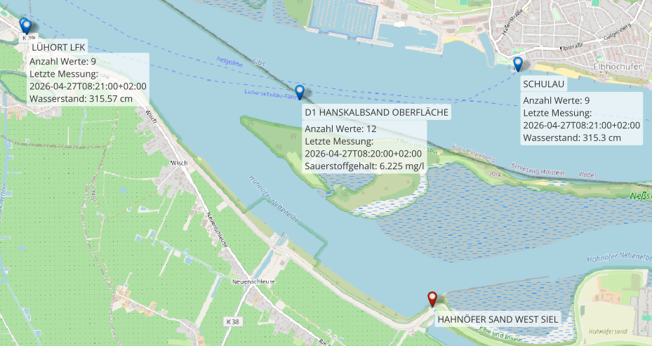

# QPegel 

 
 

A QGIS plugin for interactive hydrological sensor station discovery via **DICT API** and push-based, real-time data visualization using the **MQTT** protocol.

The plugin was developed based on the [PegelOnline](https://www.pegelonline.wsv.de/gast/start) and [EDIS](https://www.itzbund.de/DE/itloesungen/egovernment/echtzeitdateninfrastruktur/edis.html) projects.

## Installation
### Dependencies
- qpip
- paho-mqtt
- pandas
- matplotlib

### Installation via zip
1. Download QPegel from Github
2. In QGIS open from menu: Plugins -> Manage and Install Plugins... -> Install from ZIP
3. Choose QPegel-master.zip
4. Click "Install Plugin"
5. Click **Yes** \

6. For the next two screens, check the settings and click **OK**

7. Check for the QPegel logo in your QGIS toolbars
    - if necessary, add the "Plugins Toolbar" to your QGIS interface

## Core Features
### Station Search & Handling
**Search:** Integrated DICT-API for easy map- and parameter-based station search\

**Handling:** subscribe, unsubscribe or remove selected stations\

### Visualization
**Plots:** view data (updating automatically with new incoming data)\

**Map:** view stations and latest measurement in the map canvas\

## Usage
### Information
> - This plugin is only usable with valid user data. If you are interested to use it, contact us at [52°North](https://52north.org/about-us/contact-us/).
> 
> - A minimum QGIS version of 3.99 is required.
> 
> - To connect and receive data, a stable internet connection is required.
> 
> - If interested, find more detailed information in the [Documentation](https://github.com/Juliarotert/QPegel/blob/master/docs/documentation.md) 

### Example Workflow
Optional: Add PegelOnline WMS to your project: https://pegelonline.wsv.de/webservices/gis/wms/aktuell/mnwmhw?request=GetCapabilities&service=WMS&version=1.3.0

1. User Authentification
    - fill in the user data and click **Connect**
2. Set request parmeters (Tab "Request")
    - define your AOI
        - click **Draw Area of Interest**
        - draw a polygon in the map 
        - finish by right-clicking
    - add parameters
        - open **Additional Parameters** 
        - add a river (located in your AOI!)
    - **Info:** if there is no parameter input, you will receive all existing stations
3. Click **Send Request**
    - **Info:** you can send multiple requests with different parameters, the new stations will be appended to the previously retrieved ones
5. Select Available Stations of Interest
6. **Subscribe**
    - the selected stations are added to the layer panel and will store incoming data (have a look in the attribute table later)
    - as soon as the first data arrives you can also see a label showing a small station statistic
7. Switch to the Tab "View Data"
    - choose a station
    - choose visible units (if >1 available)
8. **Wait and see new data arrive...**

