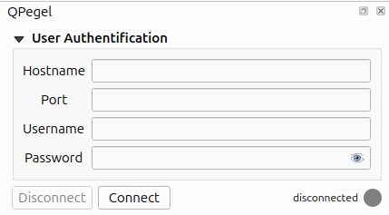
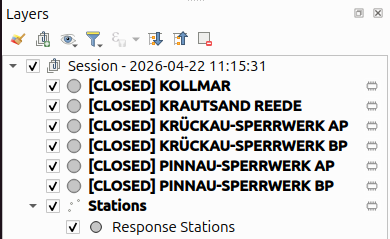

# QPegel Documentation 

... work in progress ...

## Table of Contents
1. [Intro](#Intro)
2. [Plugin Concept](#Concept)
3. [Features](#Features)
4. [Functionalities](#Functionalities)
5. [Outlook](#Outlook)

## Intro
QPegel: A QGIS plugin for interactive hydrological sensor station discovery via **DICT API** and push-based, real-time data visualization using the **MQTT** protocol.

### About QPegel
QPegel was developed based on the real-time access mechanisms offered by PegelOnline infrastructure and the related EDIS project. 
While current solutions often rely on historical pull-based data, QPegel takes hydrological monitoring to the next level. 
By leveraging the MQTT protocol, the plugin enables a seamless transition from discovery to live subscription. 
Since hydrological sensor data is inherently spatial, visualizing these streams directly within QGIS provides the necessary geographic context
to understand regional trends and dependencies within and between water bodies.

In addition, QPegel relies on the [PegelOnline DICT API](https://dict-api.pegelonline.wsv.de/api/#/Suche/search) for station discovery. 
This API provides the necessary metadata and MQTT topics required to subscribe to live data streams. 
QPegel serves as a pioneering approach to integrating these tools into a spatial environment.

### PegelOnline
[PegelOnline](https://www.pegelonline.wsv.de/gast/start) is a german platform providing real-time raw, hydrological sensor data of federal waterways.
While it offers data of the last 30 days as free web services, such as WMS, WFS, API's or Visualizations, 
it also provides downloadable data from January 1, 2000 onwards.

### EDIS
[EDIS](https://www.itzbund.de/DE/itloesungen/egovernment/echtzeitdateninfrastruktur/edis.html) (Echzeitdateninfrastruktur - Real-Time Data Infrastructure) upgrades the PegelOnline project.
Compared to the existing **pull**-based services, EDIS enables **push**-based data delivery by applying the MQTT-Protocol 
and is an innovative approach not only interesting for hydrological data provision.

## Concept
QPegel should make it easily possible to search for stations, subscribe to them 
and watch visualizations updating in real-time with every new message.
The Plugin handles the connection to the MQTT-broker, sends, receives and processes requests and their results.
It enables simple subscribing or unsubscribing to station topics, handles incoming messages as well as 
the appropriate data storage for visualization in the QGIS map canvas and as plots.

### Sessions
Definition of a Session in QPegel: 
- Session Start: with successful connection after clicking **Connect**
  - connecting to the MQTT broker enables to receive messages from (later in the plugin usage) subscribed topics
  - a disconnection will not end the session but will stop the receiving of messages until the plugin re-connects
- Session End: with Button **Quit Session** or quitting QGIS
  - the sessions still contain the collected data after quitting but a session cannot be reactivated/ reconnected
- Session Content: 
  - **Layergroup:** created with session start to store all relevant map layers and to distinguish between the active session and previous ones
  - **Stations layer:** containing all requested stations
  - **Layer for each (once) subscribed station:** to store data for labels & table view
  - **Stationlayer mapping:** dictionary storing station name, ID & active states
  - **Plot mapping:** dictionary storing data (time & value) and relevant information for all stations, sorted by units

### Requests, Responses & Messages
DICT API Requests retrieve station metadata, including MQTT topics for subscription. 
Once a subscription is active, incoming messages are assigned to the correct stations 
by matching unique attributes like the station longname.

**DICT API Response:**
- Request: https://dict-api.pegelonline.wsv.de/search?station=Kollmar
```json
{
  "mqtttopics": [
    "edis/pegelonline/+/+/+/+/3ed90357-4b01-4119-b1c5-bd2c62871e7b/+"
  ],
  "pegelonlinelinks": [
    "https://www.pegelonline.wsv.de/webservices/rest-api/v2/stations/3ed90357-4b01-4119-b1c5-bd2c62871e7b/W/measurements.json",
    "https://www.pegelonline.wsv.de/webservices/rest-api/v2/stations/3ed90357-4b01-4119-b1c5-bd2c62871e7b/LT/measurements.json",
    "https://www.pegelonline.wsv.de/webservices/rest-api/v2/stations/3ed90357-4b01-4119-b1c5-bd2c62871e7b/WT/measurements.json"
  ],
  "stations": [
    {
      "uuid": "3ed90357-4b01-4119-b1c5-bd2c62871e7b",
      "number": "5970025",
      "shortname": "KOLLMAR",
      "longname": "KOLLMAR",
      "km": 666.9,
      "agency": "STANDORT HAMBURG",
      "longitude": 9.459762,
      "latitude": 53.731123,
      "water": {
        "shortname": "ELBE",
        "longname": "ELBE"
      },
      "timeseries": [
        {
          "shortname": "W",
          "longname": "WASSERSTAND ROHDATEN",
          "unit": "cm",
          "equidistance": 1,
          "gaugeZero": {
            "unit": "m. ü. NHN",
            "value": -5.039,
            "validFrom": "2019-11-01"
          },
          "mqtttopic": "edis/pegelonline/+/+/+/+/3ed90357-4b01-4119-b1c5-bd2c62871e7b/W",
          "pegelonlinelink": "https://www.pegelonline.wsv.de/webservices/rest-api/v2/stations/3ed90357-4b01-4119-b1c5-bd2c62871e7b/W/measurements.json"
        },
        {
          "shortname": "LT",
          "longname": "LUFTTEMPERATUR ROHDATEN",
          "unit": "°C",
          "equidistance": 1,
          "mqtttopic": "edis/pegelonline/+/+/+/+/3ed90357-4b01-4119-b1c5-bd2c62871e7b/LT",
          "pegelonlinelink": "https://www.pegelonline.wsv.de/webservices/rest-api/v2/stations/3ed90357-4b01-4119-b1c5-bd2c62871e7b/LT/measurements.json"
        },
        {
          "shortname": "WT",
          "longname": "WASSERTEMPERATUR ROHDATEN",
          "unit": "°C",
          "equidistance": 1,
          "mqtttopic": "edis/pegelonline/+/+/+/+/3ed90357-4b01-4119-b1c5-bd2c62871e7b/WT",
          "pegelonlinelink": "https://www.pegelonline.wsv.de/webservices/rest-api/v2/stations/3ed90357-4b01-4119-b1c5-bd2c62871e7b/WT/measurements.json"
        }
      ],
      "country": "Deutschland",
      "country_alternatives": [
        "Germany",
        "Niemcy",
        "Alemaña",
        "Allemagne",
        "Duitsland"
      ],
      "land": "Schleswig-Holstein",
      "land_alternatives": [
        "Szlezwik-Holsztyn",
        "Sleeswijk-Holstein"
      ],
      "kreis": "Kreis Steinburg",
      "kreis_alternatives": [
        "IZ"
      ],
      "einzugsgebiet": "Elbe",
      "mqtttopic": "edis/pegelonline/+/+/+/+/3ed90357-4b01-4119-b1c5-bd2c62871e7b/+"
    }
  ]
}
```

**MQTT Message:**
```json
{
    "uuid":"bacb459b-0f24-4233-bb35-cd224a51678e",
    "number":"5952065",
    "shortname":"BLANKENESE UF",
    "state":"Deutschland",
    "region":"HAMBURG",
    "agency":"Hamburg Port Authority",
    "water":{"shortname":"ELBE"},
    "timeseries":{
        "uuid":"5c44dc92-41bb-4752-b3ca-a8cdac39f1db",
        "shortname":"W",
        "longname":"Wasserstand",
        "unit":"cm",
        "equidistance":1.0,
        "measurement":{
            "timestamp":"2026-02-18T14:26:00+01:00",
            "value":556.0
        }
    }
}
```

### Data Storage
To enable a map- but also a plot-view of the received data, the data is stored as vector-files added as map-layers, as well as in a dictionary which contains the data in a structure to easily add values and transform to a plottable dataframe.
Both storages are updated with each new messages. The data is preprocessed by skipping values of duplicate timestamps.

**Map/ Layers**\
To visualize data in the QGIS map-canvas, it must be included as a layer. To realize this, for each subscribed station a vectorlayer is created and added to the project/ session group.
These layers contain the data from all received messages.

Layer types:
- **Stations layer** (Point) as central layer for visualization -> never delete!
- **Single station layers** (Point) without coordinate for data storage, stations layer reference and symbol synchronization with layer overview in plugin
- **Polygon layer** showing the AOI

**Attribute table stations layer:**\


**Attribute table single station layer:**\


**Plot/ Dataframe Mapping**\
To easily plot the data and update the plots fast with incoming messages, all values and additional information is stored in a dataframe. 
All incoming data is appended automatically. Data of previous sessions can be added automatically by choosing the layer as plot layer. 

**Stationlayer mapping:**
```
{
    "GLÜCKSTADT": {
        "id": "GL_CKSTADT_6db8b794_33c1_4680_b683_dac2de1ccc12",
        "active": False
    },
    "KRAUTSAND REEDE": {
        "id": "KRAUTSAND_REEDE_f2801a1e_bb74_4c4a_a690_d0e6e62370a0",
        "active": True
    }
 }
```

**Plot Mapping:**
```
{
    "GLÜCKSTADT": {   
        "Wasserstand": {
            "data": [{
                    "timestamp": Timestamp("2026-04-13 11:03:00+0200", tz="UTC+02:00"), 
                    "value": 588.7
             }],
             "timestamps": [Timestamp("2026-04-13 11:03:00+0200")],
             "unit": "cm",
             "type": "measurement",
             "active": True
         }
    }
}
```

## Features
### User Authentification & Connection
A valid combination of hostname, port, username and password is required to connect.



|                     state                      | meaning                                                                                   |
|:----------------------------------------------:|-------------------------------------------------------------------------------------------|
|  | not yet connected or intentionally disconnected                                           |
|     | currently connected to MQTT Broker                                                        |
|         | connection error: <br/>problems could be invalid user data or loss of internet connection |

### DICT-API
The PegelOnline DICT API is integrated in the following way:
- **Map-based search:** spatial parameters (land, country, ...) are replaced by polygon search
  - makes use of extent and checks if station coordinate intersects the polygon geometry
- **Parameter search:** additional non-spatial (or in case of water bodies less continuously spatial) parameters (station, parameter, q) can be added by text fields

Furthermore, all stations received by the requests are added to a list of available stations. 
By selecting stations in this list, stations can be subscribed, unsubscribed or removed from the list and if available also from the map.\
As soon as stations were added as map layers, their states and existence is synchronized.

| station color |                                                       meaning                                                        |
|:-------------:|:--------------------------------------------------------------------------------------------------------------------:|
|     red       | layer was never subscribed/ added to the map<br/> but was included in the response and is available to be subscribed |
|     green     |                                                 currently subscribed                                                 |
|    orange     |                                                currently unsubscribed                                                |

 

### Visualization
**Map & Layers:**\
The layer panel gives an overview over the stations states, and contains the requested stations and, if available, the polygon layer.\
In the map canvas, all stations received by the request(s) are shown as red map markers. 
As soon as a station was subscribed and added to the layer-group, the marker appears in blue no matter if the station is currently subscribed or not.
If a station receives data, an additional label, showing a small statistic about the total measurements and the latest timestamp, unit and value, becomes visible.

| layer color |                 meaning                  |
|:-----------:|:----------------------------------------:|
|    green    |           currently subscribed           |
|   orange    |          currently unsubscribed          |
|    gray     | closed layer: session has been quitted   |

  

**View Data Tab:**\
The second visualization method involves plotting the received station-data categorized by units. 
First, the user selects a station layer from the current QGIS project. 
The available layers are automatically filtered by geometry and attributes to exclude irrelevant data, such as polygons or raster-layers.

\

By enabling the "only show currently subscribed layers" checkbox, the list is further refined to exclude unsubscribed or closed stations.\
 

Toggling the check-states of available units triggers an update of the plot.
\

In general, the plots are updated with changing layer/ station, filter-check-box state change, changing unit selection and with every new message/ value.
If closed layers contain data, they are also plottable. 

**Logs Tab:**\
In the Logs tab raw station information, data and states are viewable. 
The text-fields show the original stationlayer and plot mapping dictionaries as they are used for plotting and plugin functionality and also update in real-time.


### Functionality Overview

| UI Section         | Functionalities                                                                                                                                                                                                                       |
|:-------------------|:--------------------------------------------------------------------------------------------------------------------------------------------------------------------------------------------------------------------------------------|
| Login              | <ul><li>user data input</li><li>connect/ disconnect</li></ul>                                                                                                                                                                         |
| Request Tab        | <ul><li>polygon digitalization</li><li>parameter input</li><li>request</li> <ul><li>url creation</li><li>send/ receive</li><li>result processing</li></ul> <li>station subscription</li><li>layer/ station remove handling</li> </ul> |
| View data Tab      | <ul><li>layer filtering & selection</li><li>unit selection</li><li>view plots</li></ul>                                                                                                                                               |
| Logs Tab           | view data storage, information and new entries                                                                                                                                                                                        |
| Background actions | <ul><li>layer & group creation</li><li>message handling</li><li>data storage & state handling</li><li>plot updating</li></ul>                                                                                                         |
| Help/ Quit         | find helping instructions or quit session and reset plugin                                                                                                                                                                            |


## Outlook
In the future, the plugin has some potential for further development. Some examples ar listed in the following:
- include past 30 days data
- compare stations
- plugin generalization - different data types and providers
- improve visualization in map and plots

Feedback, comments and suggestions for improvement or contributions are highly welcome. 
Please contact [52°North](https://52north.org/about-us/contact-us/)! 