# QPegel Documentation 

... work in progress ...

## Table of Contents
1. [Intro](#Intro)
2. [Plugin Concept](#Concept)
3. [Features](#Features)
4. [Functionalities](#Functionalities)
5. [Tips](#Tips)

## Intro
- Description
- Further Information
  - PegelOnline
    - Content
    - existing Services
  - EDIS
    - Components/ Concept

## Concept
### Sessions
Definition of a Session in QPegel: 
- Session Start: with successful connection
  - connecting to the MQTT broker enables to receive messages from (later in the plugin usage) subscribed topics
  - a disconnection will not end the session but will stop the receiving of messages until the plugin re-connects
- Session End: with Button **Quit Session** or quitting QGIS
  - the sessions still contain the collected data after quitting but a session cannot be reactivated/ reconnected 
- Session Content: 
  - Layergroup: created with session start to store all relevant map layers and to distinguish between the active session and previous ones
  - Stations layer: containing all requested stations
  - Layer for each (once) subscribed station: to store data for labels & table view
  - Stationlayer mapping: dictionary which stores station name, ID & active states
  - Plot mapping: dictionary which stores data & relevant information for all stations, sorted by units

### Data Storage
To enable a map- but also a plot-view of the received data, the data is stored as vector-files added as map-layers, as well as in a dictionary which contains the data in a structure to easily add values and transform to a plottable dataframe.
Both storages are updated with each new messages. The data is preprocessed by skipping values of duplicate timestamps.

**Map/ Layers**\
To visualize data in the QGIS map-canvas, it must be included as a layer. To realize this, for each subscribed station a vectorlayer is created and added to the project/ session group.
These layers contain the data from all received messages.

**Plot/ Dataframe Mapping**\
To easily plot the data and update the plots fast with incoming messages, all values and additional information is stored in a dataframe. 
All incoming data is appended automatically. Data of previous sessions can be added automatically by choosing the layer as plot layer. 

### Data Examples
**DICT API Response:**\
Parameter "station" = Kollmar
```json
{
  "mqtttopics": [
    "edis/pegelonline/+/+/+/+/3ed90357-4b01-4119-b1c5-bd2c62871e7b/+"
  ],
  "pegelonlinelinks": [
    "https://www.pegelonline.wsv.de/webservices/rest-api/v2/stations/3ed90357-4b01-4119-b1c5-bd2c62871e7b/W/measurements.json",
    "https://www.pegelonline.wsv.de/webservices/rest-api/v2/stations/3ed90357-4b01-4119-b1c5-bd2c62871e7b/LT/measurements.json",
    "https://www.pegelonline.wsv.de/webservices/rest-api/v2/stations/3ed90357-4b01-4119-b1c5-bd2c62871e7b/WT/measurements.json"
  ],
  "stations": [
    {
      "uuid": "3ed90357-4b01-4119-b1c5-bd2c62871e7b",
      "number": "5970025",
      "shortname": "KOLLMAR",
      "longname": "KOLLMAR",
      "km": 666.9,
      "agency": "STANDORT HAMBURG",
      "longitude": 9.459762,
      "latitude": 53.731123,
      "water": {
        "shortname": "ELBE",
        "longname": "ELBE"
      },
      "timeseries": [
        {
          "shortname": "W",
          "longname": "WASSERSTAND ROHDATEN",
          "unit": "cm",
          "equidistance": 1,
          "gaugeZero": {
            "unit": "m. ü. NHN",
            "value": -5.039,
            "validFrom": "2019-11-01"
          },
          "mqtttopic": "edis/pegelonline/+/+/+/+/3ed90357-4b01-4119-b1c5-bd2c62871e7b/W",
          "pegelonlinelink": "https://www.pegelonline.wsv.de/webservices/rest-api/v2/stations/3ed90357-4b01-4119-b1c5-bd2c62871e7b/W/measurements.json"
        },
        {
          "shortname": "LT",
          "longname": "LUFTTEMPERATUR ROHDATEN",
          "unit": "°C",
          "equidistance": 1,
          "mqtttopic": "edis/pegelonline/+/+/+/+/3ed90357-4b01-4119-b1c5-bd2c62871e7b/LT",
          "pegelonlinelink": "https://www.pegelonline.wsv.de/webservices/rest-api/v2/stations/3ed90357-4b01-4119-b1c5-bd2c62871e7b/LT/measurements.json"
        },
        {
          "shortname": "WT",
          "longname": "WASSERTEMPERATUR ROHDATEN",
          "unit": "°C",
          "equidistance": 1,
          "mqtttopic": "edis/pegelonline/+/+/+/+/3ed90357-4b01-4119-b1c5-bd2c62871e7b/WT",
          "pegelonlinelink": "https://www.pegelonline.wsv.de/webservices/rest-api/v2/stations/3ed90357-4b01-4119-b1c5-bd2c62871e7b/WT/measurements.json"
        }
      ],
      "country": "Deutschland",
      "country_alternatives": [
        "Germany",
        "Niemcy",
        "Alemaña",
        "Allemagne",
        "Duitsland"
      ],
      "land": "Schleswig-Holstein",
      "land_alternatives": [
        "Szlezwik-Holsztyn",
        "Sleeswijk-Holstein"
      ],
      "kreis": "Kreis Steinburg",
      "kreis_alternatives": [
        "IZ"
      ],
      "einzugsgebiet": "Elbe",
      "mqtttopic": "edis/pegelonline/+/+/+/+/3ed90357-4b01-4119-b1c5-bd2c62871e7b/+"
    }
  ]
}
```

**MQTT Message:**
```json
{
    "uuid":"bacb459b-0f24-4233-bb35-cd224a51678e",
    "number":"5952065",
    "shortname":"BLANKENESE UF",
    "state":"Deutschland",
    "region":"HAMBURG",
    "agency":"Hamburg Port Authority",
    "water":{"shortname":"ELBE"},
    "timeseries":{
        "uuid":"5c44dc92-41bb-4752-b3ca-a8cdac39f1db",
        "shortname":"W",
        "longname":"Wasserstand",
        "unit":"cm",
        "equidistance":1.0,
        "measurement":{
            "timestamp":"2026-02-18T14:26:00+01:00",
            "value":556.0
        }
    }
}
```

**Attribute table stations:**\
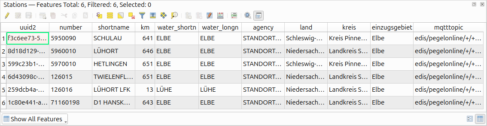

**Attribute table single station:**\
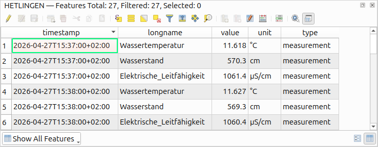

**Stationlayer mapping:**
```json
{
    "GLÜCKSTADT": {
        "id": "GL_CKSTADT_6db8b794_33c1_4680_b683_dac2de1ccc12",
        "active": False
    },
    "KRAUTSAND REEDE": {
        "id": "KRAUTSAND_REEDE_f2801a1e_bb74_4c4a_a690_d0e6e62370a0",
        "active": True
    }
 }
```

**Plot Mapping:**
```json
{
    "GLÜCKSTADT": {   
        "Wasserstand": {
            "data": [{
                    "timestamp": Timestamp("2026-04-13 11:03:00+0200", tz="UTC+02:00"), 
                    "value": 588.7
             }],
             "timestamps": [Timestamp("2026-04-13 11:03:00+0200")],
             "unit": "cm",
             "type": "measurement",
             "active": True
         }
    }
}
```

## Features
### Login states

|                     state                      | meaning                                                                                        |
|:----------------------------------------------:|------------------------------------------------------------------------------------------------|
|  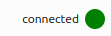   | currently connected to MQTT Broker                                                             |
| 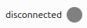 | not yet connected or intentionally disconnected                                                |
|    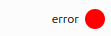     | connection went wrong: <br/>problems could be invalid user data or loss of internet connection |

### DICT-API
- map-based parameters replaced by polygon search
- makes use of extent and check if station is inside the polygon by intersection
- additional non-spatial parameters added in text fields

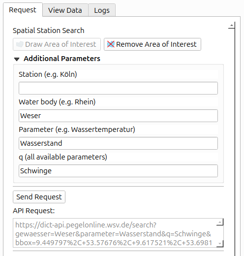 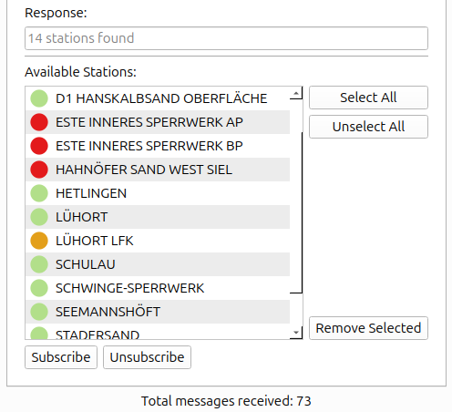

### Visualization
**Map & Layers:**
- available station locations
- state of each station (green/orange/gray)
- polygon
- statistic
  - total measurements
  - latest message time & value

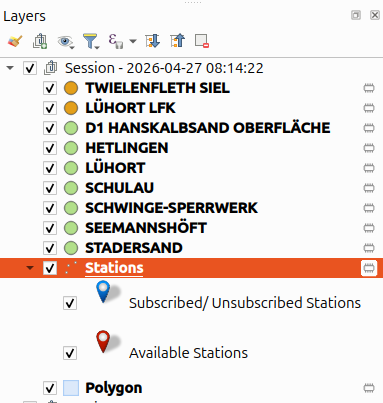 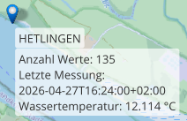

**View Data Tab:**\
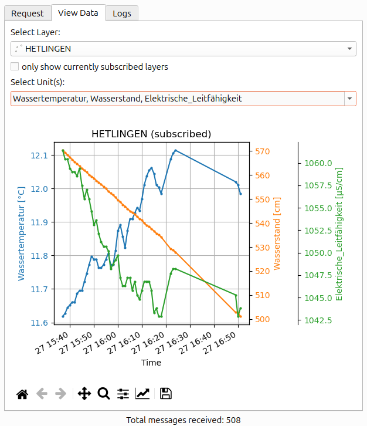\
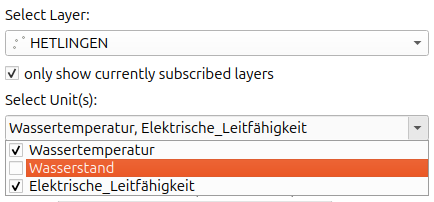\
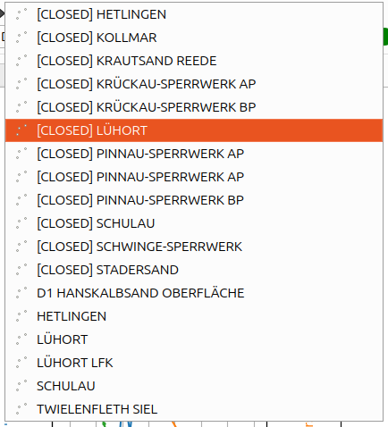 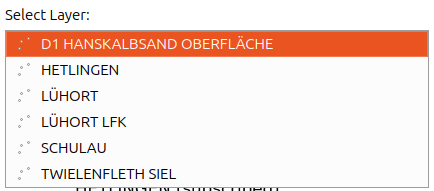

**Logs Tab:**\
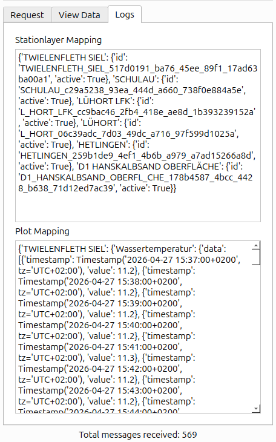

## Functionalities
- Login
- Request Tab
  - Polygon 
  - Parameters
  - Request
    - creation
    - processing
  - Station Subscribtion
  - Layer remove handling 
- Background actions
  - layer creation
  - Message handling
  - data assignment
- View data Tab
  - Layer Filtering
  - Layer selection
  - Unit collection
  - state storage
  - plot variants
  - plot updating
- Logs Tab
- Quit/ reset

## Tips
- stations layer as central layer for visualization -> never delete!
- vector layers without coordinate for data storage, stations layer reference and symbol synchronization with layer overview in plugin